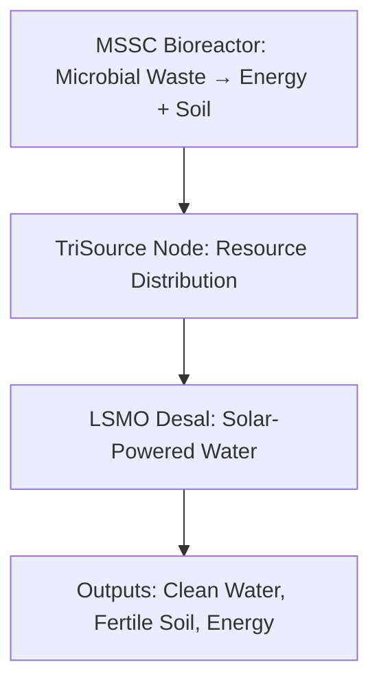

# eMSSC² System Diagram (Mermaid)

```mermaid
graph TD
    A[MSSC Bioreactor: Microbial Waste → Energy + Soil] --> B[TriSource Node: Resource Distribution]
    B --> C[LSMO Desal: Solar-Powered Water]
    C --> D[Outputs: Clean Water, Fertile Soil, Energy]
```

Figure: Simplified flow of MSSC → TriSource → UNIST SPMD → Outputs.

---
