# 💧 Tri-Source Water Node™  
### Regenerative Water Infrastructure for Sovereign Communities  
**Version 1.2 — Peer-Reviewed Refinement**  
**Authors:** Justin Bilyeu & Sage  
**Team:** SunShare Connect™ Initiative + GGCDs  
**Repository:** [SunShare-TriSource](https://github.com/justindbilyeu/SunShare-TriSource)

---

## 🔷 Executive Summary

The **Tri-Source Water Node™** is a modular, solar-powered infrastructure system that integrates three regenerative technologies:

- 🌀 **HydroLens™** — atmospheric water harvesting (AWH) via solar-regenerated desiccants  
- 🧫 **MSSC Node™** — microbial greywater treatment and nutrient cycling  
- 🌊 **SPMD** — solar-powered membrane distillation and/or hybrid low-pressure RO

Designed for arid, coastal, and off-grid regions, the system delivers **60–65 L/day** of clean water and fertility outputs using **<7 kWh/day**, without external chemicals or fossil fuels.  
This document reflects the latest technical, ecological, and geopolitical analyses validating its global potential.

---

## 1. Introduction

Water scarcity and soil degradation threaten more than 4 billion people annually. Current responses—centralized desalination, bottled logistics—are extractive and unstable.

The Tri-Source Node™ proposes a **regenerative, closed-loop model** for water generation that prioritizes community sovereignty, local adaptation, and ecological restoration.

---

## 1.1 Design Philosophy

- **Water Sovereignty** — local ownership of sourcing, treatment, and reuse  
- **Regenerative Justice** — treat waste as resource; restore soil & water cycles  
- **Open Hardware** — reproducibility through shared plans, local materials  

---

## 2. System Overview

| Module      | Function                           | Output                      | Input |
|-------------|------------------------------------|-----------------------------|-------|
| HydroLens™  | AWH via LiCl/silica & solar heat   | 2–5 L/day                   | Air, Sunlight |
| MSSC Node™  | Greywater → compost/biofertility   | 40 L/day, 5–10 L/week soil | Greywater |
| SPMD Unit   | Desalination via solar MD/RO       | 20 L/day potable water      | Saline/Brackish |

Total System Output: **60–65 L/day**  
Total Energy Use: **~6.8 kWh/day**  
Power Input: **5.0–6.5 kW PVT recommended**

```mermaid
flowchart TD
    Air((Atmospheric Moisture))
    Solar((Sunlight))
    Saline[Brackish / Seawater]
    Greywater[Greywater / Runoff]

    AWH[HydroLens™ AWH]
    MSSC[MSSC Node™]
    SPMD[Solar Desalination]

    Potable[Potable Water Storage]
    NonPotable[Non-Potable Storage]
    Soil[Soil / Irrigation]
    Brine[Brine Mgmt / Halophytes]
    Compost[Nutrient Compost]

    Air --> AWH
    Saline --> SPMD
    Greywater --> MSSC

    AWH -->|Condensate| MSSC
    AWH -->|Potable| Potable
    MSSC -->|Treated Water| SPMD
    MSSC -->|Fertility Sludge| Compost
    MSSC -->|Non-Potable| NonPotable
    SPMD -->|Freshwater| Potable
    SPMD -->|Brine| Brine

    Compost --> Soil
    NonPotable --> Soil
```

<!-- TODO: Add full schematic with thermal/potable/fertility loops -->

---

## 3. Module Design & Specs

### 3.1 HydroLens™ — Atmospheric Water Generator
- Sorption-based (LiCl/silica; MOF-R&D ongoing)
- Desorption temp: 60–120°C (solar thermal)
- Thermal use: ~0.4–1.0 kWh/L  
- RH-effective range: 35–80%  
<!-- TODO: Add RH-efficiency curve + psychrometric diagram -->

### 3.2 MSSC Node™ — Microbial Fertility Reactor
- Multi-phase microbial processing (aerobic + anaerobic + MDC)
- Output: 40 L/day irrigation, compost, <1 kWh/day
- MDCs: Geobacter + Shewanella (lab-verified; real-world TBD)
<!-- TODO: Add COD/BOD inflow targets + MDC voltage spec -->

### 3.3 SPMD — Desalination Unit
- Modes: Solar MD or PV/RO (modular swap)
- Output: 20 L/day potable
- Energy: 0.5–2.5 kWh/m³
- Brine routed to: halophytes, MSSC, or heat recovery
<!-- TODO: Add brine salinity risk thresholds -->

---

## 4. Energy & Water Budget

| Component     | Power (kWh/day) | Output (L/day) |
|---------------|------------------|----------------|
| HydroLens™    | ~2.5             | 2–5            |
| MSSC Node™    | ~2.0             | 40             |
| SPMD          | ~0.3–0.5         | 20             |
| Aux Pumps/UI  | ~2.0             | —              |

**Total**: ~6.8 kWh/day  
**Yield**: ~62–65 L/day  
**Battery**: 15 kWh recommended  
**Storage**: 150 L potable + 100 L grey

---

## 5. Integration Feedback Loops

- 🔁 Waste heat from MD → AWH regeneration  
- 🔁 Brine from SPMD → halophytes or MSSC  
- 🔁 Fertility loop: MSSC → compost → soil moisture retention  
- 🔁 Electrical: shared battery/pump control (AI-enhanced optional)

---

## 6. Deployment Scenarios

| Site Type         | Benefit                       | Region Focus |
|-------------------|-------------------------------|---------------|
| Farm/Ranch Node   | Irrigation + potable          | TX, NM, AU    |
| School + Clinic   | Hygiene + greywater cycling   | Africa, India |
| Coastal Village   | Desal + compost reuse         | Senegal, Peru |

---

## 7. Cost, ROI & LCOW

| Category            | Estimate       |
|---------------------|----------------|
| Total CapEx         | $5k–$15k/node  |
| LCOW                | $2.50–3.50/m³  |
| Payback Time        | 3–6 years      |
| Value Additions     | Soil fertility, resilience, credits

<!-- TODO: Add component-level BoM table -->

---

## 8. Risks & Mitigations

| Risk                    | Mitigation                                   |
|-------------------------|----------------------------------------------|
| Biofouling (MSSC/SPMD)  | Pre-treatment + ultrasonic + UV-C options    |
| Sorbent fatigue (AWH)   | Use MOF/HIPG alternates                      |
| Scaling (MD)            | Use PCM buffers + optimized flushing         |
| Community adoption      | Co-design + visual training                  |

---

## 9. Why Isn’t Solar Desalination Everywhere?  
### Systems-Level Failure Analysis (condensed)

| Barrier                  | Tri-Source Response                             |
|--------------------------|--------------------------------------------------|
| Siloed tech              | Fully integrated thermal, microbial, solar loop |
| High unit LCOW           | Target diesel/logistics-displaced sites         |
| Biofouling               | MSSC pre-treatment + redundancy                 |
| Policy + regulation      | Frame as SDG6/ESG infra                         |
| Investor misalignment    | Modular, revenue-stacking ROI path              |

<!-- TODO: Add water-energy-nutrient mass balance chart -->

---

## 10. Global Innovation Outlook  
(Highlights from Gemini Critique)

- 💡 **Materials R&D**: MOFs, MXenes, GO membranes for higher AWG and SPMD efficiency  
- 🧬 **Microbial Expansion**: Engineered consortia for nutrient recovery  
- 🗺️ **Deployment Zones**: India, Sub-Saharan Africa, LATAM—aligned with SDG6 & water independence funding  
- 💸 **Funding Pathways**: USAID, Green Climate Fund, Horizon Europe pilots  
- 📊 **Competitive Distinction**: Regenerative outputs + modularity + passive-first design  

---

## 11. Future Work

- v1.3: Add Sankey diagram + thermal mass modeling  
- Pilot deployments: Gulf Coast, Tamil Nadu, Senegal  
- AI system integration for water prediction, microbial cycle optimization  
- Open hardware release via LibreWater & SunShare GitHub

---

## 12. References

➡️ See [`docs/bibliography.md`](./bibliography.md)  
<!-- TODO: Format in BibTeX + SciSpace recommended references -->

---

## 13. Appendix

- Psychrometric modeling (HydroLens™)  
- COD/BOD targets for MSSC Node™  
- PCM buffer specs for solar MD  
➡️ See [`docs/appendix.md`](./appendix.md)

---

© 2025 SunShare Connect Initiative — All rights reserved.
