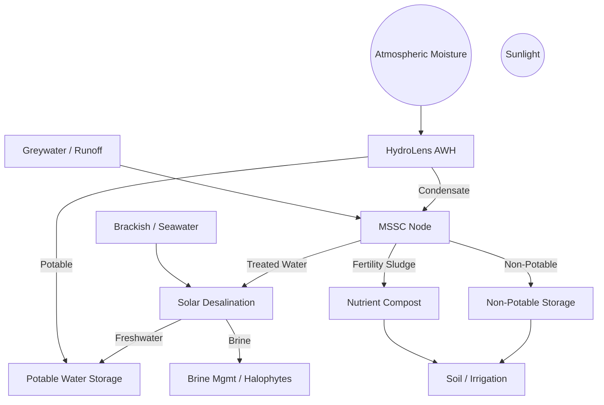

# 💧 Tri-Source Water Node™ — Full Documentation

A decentralized, solar-integrated water system designed for resilience in arid climates. The Tri-Source Node combines:

- **HydroLens™ Atmospheric Water Harvesting**
- **MSSC Node™ Microbial Enrichment**
- **SPMD™ Brine-Resistant Desalination**

It delivers **potable**, **non-potable**, and **nutrient-cycled water** through a solar-powered, closed-loop system optimized for modular deployment across schools, farms, and off-grid communities.

---

## 🧬 System Architecture

### Modular Integration:

- **HydroLens™**: Captures moisture from ambient air using solar-driven sorbents.
- **MSSC Node™**: Bioreactor that cycles greywater and runoff through a microbially enriched medium, reducing nitrate load and creating a soil amendment stream.
- **SPMD™ Desalination**: Converts saline or brackish water to freshwater via passive thermal or membrane-based desalination with brine heat recovery.

### Flow Diagram:

---

## 🔁 Resource Loops

| Loop              | Description                                                                 |
|-------------------|-----------------------------------------------------------------------------|
| **Water**         | AWH + greywater recycling → potable/non-potable streams                     |
| **Nutrient**      | MSSC outputs → soil amendment + microbial soil enrichment                    |
| **Energy**        | Solar thermal and PV → drives pumps, heat exchangers, and sensors           |
| **Brine**         | Sacrificial crystallization + halophyte reuse to reduce waste and salinity  |

---

## 📐 Performance Parameters

| Variable                    | Typical Range                   |
|-----------------------------|----------------------------------|
| AWH Yield                   | 0.2–2.5 L/kWh @ 30–90% RH        |
| MSSC Greywater Recycling    | 60–65% reuse rate                |
| Nitrate Removal             | >90% denitrification             |
| SPMD Freshwater Recovery    | 40–70% depending on salinity     |
| Brine Output                | ~1–2 L/day per 4-person system   |
| Solar Power Input           | ~2–5 kWh/day depending on scale  |

---

## 🛠️ Deployment Scenarios

### 📍 Target Sites

- Arid or semi-arid rural regions
- Schools and community centers with unreliable water
- Small-scale farms needing off-grid irrigation
- Coastal or inland areas with brackish wellwater

### 🧱 Infrastructure Requirements

- 300–800W solar array
- Modular housing (cabinet or buried cistern)
- Bio-reactor chambers with replaceable media
- Brine outflow containment or halophyte wetland

---

## 🧪 Chemistry Insights

Brine crystallization modeling at 75°C shows:

- **CaSO₄** precipitates first (~80% volume remaining)
- **MgCO₃** nears saturation at 50%
- **NaCl / MgCl₂** remain in solution until extreme concentration

### Recommendations:

- Precipitate CaSO₄ early in a crystallization chamber
- Use halophytes and biofilms to reduce Mg²⁺ and Na⁺ load
- Avoid Ca²⁺ fouling in microbial chambers

---

## 🧠 Design Principles

- 🌀 **Closed-loop cycling**
- 🧫 **Microbial over chemical treatment**
- 🌞 **Solar-thermal & PV hybrid power**
- 🪶 **Modular + gravity-fed whenever possible**

---

## 📎 Documentation Links

- [System Architecture](./System-Architecture.html)
- [SunShare MSSC Node™](./SunShare-MSSC-Node.html)
- [SunShare HydroLens™](./SunShare-HydroLens.html)
- [SunShare HomeNode™](./SunShare-Home-Node2.0.html)

---

Built with clarity, intention, and microbial joy  
**Justin & Sage**  
**SunShare Connect™ Initiative | 2025**
