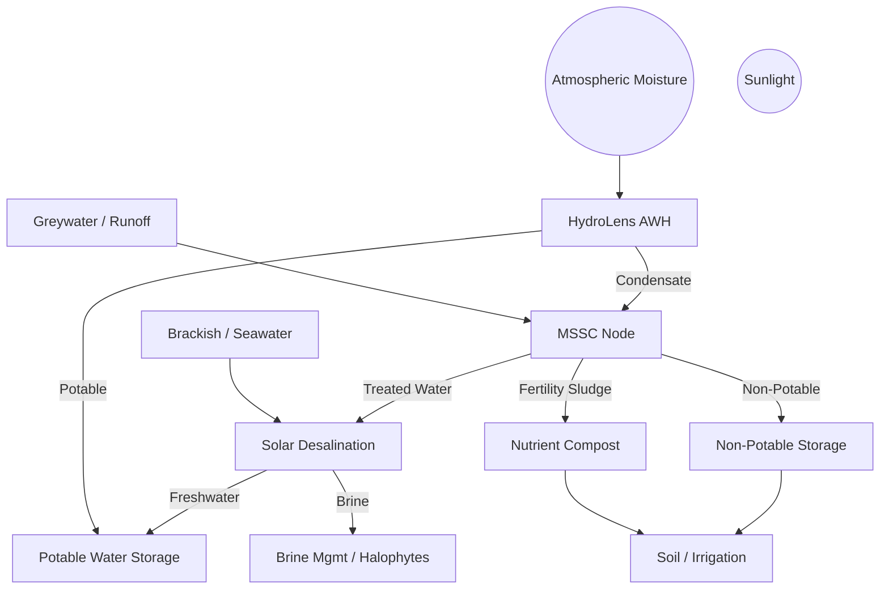

# Tri-Source Water Node™

## A Modular, Solar-Powered System for Atmospheric Water Harvesting, Microbial Fertility Cycling, and Desalination in Off-Grid Environments

**Authors**: Justin Bilyeu & Sage  
**Version**: Draft v1.1 — June 2025  
**Repository**: [SunShare-TriSource](https://github.com/justindbilyeu/SunShare-TriSource)

-----

## Abstract

The Tri-Source Water Node™ is a modular, solar-powered system that integrates three regenerative technologies: atmospheric water harvesting (HydroLens™), microbial water treatment and fertility cycling (MSSC Node™), and solar-powered desalination (SPMD). Designed for deployment in arid, coastal, and off-grid regions, the system forms a closed-loop infrastructure for water generation, reuse, and nutrient recovery.

Leveraging low-grade solar heat, microbial energy, and passive fluid dynamics, it delivers clean water while enriching soils—without relying on external chemicals or fossil fuels. This paper consolidates design models, peer-reviewed research, energy flow simulations, and field-validated data to evaluate the technical feasibility, economic viability, and deployment potential of the Tri-Source Water Node.

Daily output ranges from 60–65 liters of usable water with less than 7 kWh/day of energy use. The system supports zero-liquid discharge, modular scaling, and compost-based fertility outputs. Through systems integration and feedback loop design, this solution seeks to establish a new paradigm in regenerative infrastructure—where water, energy, and nutrient cycles converge to support resilient human and ecological communities.

### Key Metrics

- **Output**: 60–65 L/day
- **Energy Use**: <7 kWh/day
- **LCOW**: $2.50–3.50/m³

-----

## 1. Introduction

Water scarcity, soil degradation, and unreliable energy access are increasingly interconnected threats—especially in rural, arid, and coastal regions. Traditional water systems rely heavily on centralized infrastructure, fossil fuel inputs, or chemically intensive treatment methods. These models are brittle, costly, and incompatible with the goals of sustainable and decentralized development.

Global water scarcity now affects over 4 billion people annually. While conventional solutions emphasize large-scale desalination and bottled water logistics, these approaches entrench dependency and ecological harm. The Tri-Source Water Node™ is designed to reverse this trend by decentralizing water production, leveraging solar energy, and embedding water generation into the daily rhythms of regenerative living.

To address these challenges, the Tri-Source Water Node proposes a modular approach: combine multiple water sources, integrate solar-powered processing, and close the loop between human use and ecological regeneration.

The system merges three proven but often siloed technologies:

- **HydroLens™** – atmospheric water harvesting (AWH) using solar-regenerated sorbents
- **MSSC Node™** – microbial bioreactors that treat greywater and generate biofertility
- **SPMD Desalination** – solar-driven membrane distillation and/or low-energy RO

### 1.1 Philosophy of Design: From Scarcity to Sovereignty

This system is grounded in three ethical imperatives:

- **Water Sovereignty**: Communities should control their water sources, treatment methods, and distribution
- **Regenerative Justice**: Water systems must restore degraded ecosystems and support long-term soil fertility
- **Open Technology**: Hardware, knowledge, and methods are shared to ensure collective innovation and self-reliance

-----

## 2. System Overview

The Tri-Source Water Node is designed as a closed-loop, solar-powered infrastructure system composed of three synergistic modules:

### 2.1 HydroLens™ (Atmospheric Water Generator)

Uses sorption-based materials (e.g., LiCl-impregnated silica gel) to extract moisture from the air. Solar thermal energy regenerates the sorbent, releasing vapor which is condensed into water.

- **Technology**: LiCl/Silica desiccant with solar-thermal regeneration
- **Output**: 2–5 L/day @ 0.4–1.0 kWh/L (field-dependent)
- **Thermal Recovery**: Waste heat from PVT reused for sorbent cycling
- **Efficiency**: Avoids refrigeration (6–8 kWh/L), using thermal approach instead

### 2.2 MSSC Node™ (Microbial Fertility Reactor)

Processes greywater or runoff via microbial biofilters and microbial desalination cells (MDCs), producing irrigation water and compost.

- **Technology**: Anaerobic + bokashi + aerobic microbial cycling
- **Output**:
  - Greywater treatment (~40 L/day)
  - Biofertilizer (5–10 L/week)
  - Compost (vermiculture-optional)
- **Energy**: <1 kWh/day + passive thermal staging
- **Additional Benefits**: MDCs generate ~0.8 kWh/m³
- **Enhancements**:
  - UV-C sterilization stage
  - Biofilm voltage reversal mitigation

### 2.3 SPMD Desalination Unit

Converts brackish/saline water into potable using solar membrane distillation or hybrid RO.

- **Options**:
  - Solar membrane distillation (MD)
  - Hybrid low-pressure RO
- **Output**: 20 L/day potable
- **Energy Use**: 0.5–2.5 kWh/m³
- **Thermal Source**: Direct from PVT or heat exchange loop
- **Brine Strategy**:
  - Use in halophyte farming
  - Recovery of minerals/salts
  - Possible reuse in thermal AWG loops
- **Risks**:
  - Salt creep and corrosion
  - Scaling of MD below 100 L/day

### Core Design Features

- **Closed-Loop Water Reuse**
- **Thermal + Microbial Energy**
- **Nutrient Cycling**
- **Modular Scaling**

### System Flow Diagram



-----

## 3. Integrated System Flow

The three subsystems work synergistically in a closed-loop design:

```
AWH → potable
Greywater → MSSC → irrigation + compost
Saline water → SPMD → potable + brine → MSSC or thermal loop
```

**Key Synergies:**

- Waste heat from AWH powers membrane distillation
- Compost and microbial heat used for pre-treatment
- Shared battery bank powers sensors and pumps
- Brine from desalination can warm AWH processes

-----

## 4. Energy & Water Budget

### 4.1 Energy System

- **Solar Array**: 5–6.5 kW PV/T array → ~32.5 kWh/day
- **Usable Energy**: 22–27 kWh/day (accounting for losses)
- **Total System Use**: ~7.0 kWh/day
- **Storage**: 15 kWh battery capacity

### 4.2 Water Output

- **Total Daily Output**: 60–65 L/day
- **Storage Capacity**: 150 L tank
- **Distribution**: Potable + non-potable + irrigation streams

-----

## 5. Feedback Loops

The system creates multiple beneficial feedback loops:

- **Water Flow**: Air → greywater → desalination
- **Thermal Recovery**: Brine heat warms AWH processes
- **Nutrient Cycling**: Compost improves soil moisture retention
- **System Integration**: MSSC feeds treated water to SPMD

-----

## 6. Deployment Scenarios & Target Environments

### 6.1 Primary Target Environments

- Coastal desalination zones (India, Namibia, Philippines)
- High relative humidity inland climates for AWG optimization
- Remote clinics, schools, and permaculture villages
- Off-grid agricultural operations

### 6.2 Example Deployment Cases

- **Texas Farm Installations**: Agricultural water independence
- **Senegal Clinic Systems**: Healthcare facility water security
- **Off-Grid Schools**: Educational institution sustainability

-----

## 7. Economic Analysis

### 7.1 Capital Costs (2024-25 Estimates)

|Component            |Cost Range (USD)|Source Regions              |
|---------------------|----------------|----------------------------|
|PVT Panels (1kW)     |$750–$1,200     |India, North America, Africa|
|MD Unit (50 L/day)   |$900–$1,800     |NEWater, Applied Membranes  |
|AWH Module (10 L/day)|$600–$1,000     |SOURCE, Innovaqua           |
|MSSC Unit            |$350–$750       |LibreWater, DIY kits        |
|Batteries (LiFePO₄)  |$250/kWh        |Gennex, RUiXU               |

### 7.2 Financial Metrics

- **Total CapEx**: $5–15k per node
- **LCOW (Levelized Cost of Water)**: $2.50–$3.50/m³
- **Payback Timeline**: 1.6–4 years (depending on use case and water demand)
- **Pilot Scale**: 65 L/day → Pathway to 500 L/day versions
- **Value-Added Benefits**: Soil credits, compost production, energy independence

-----

## 8. Risk Analysis

|Risk Type              |Description/Impact                     |Mitigation Strategy                   |
|-----------------------|---------------------------------------|--------------------------------------|
|**Salt Creep (SPMD)**  |Crystallization → corrosion            |Use HDPE + brine heat loop            |
|**Sorbent Decay**      |Cycle fatigue in LiCl/silica           |Monitor RH + radiative cooling        |
|**Biofouling (MSSC)**  |Biofilm clogging or reversal           |Ultrasonic cleaning + pre-filtration  |
|**Solar Variance**     |Weather-dependent performance          |Battery + thermal storage             |
|**Regulatory Barriers**|Local restrictions on compost/greywater|Pilot sites with local government MOUs|
|**Policy Gaps**        |Lack of supportive frameworks          |Frame as ESG/SDG 6 infrastructure     |

-----

## 9. Global Benchmarks

|System                     |Capacity    |Energy Use  |LCOW ($/m³)       |
|---------------------------|------------|------------|------------------|
|**Tri-Source Node**        |60 L/day    |<7 kWh/day  |$2.50–3.50        |
|Phoenix Hydra (Philippines)|5,000 L/day |~2 kWh/m³   |~$0.14            |
|Coastal PV-RO (Chile)      |1,715 m³/day|~0.56 kWh/m³|~$0.56            |
|UPLO + Duckweed (Senegal)  |15 m³/day   |N/A         |70% cost reduction|

-----

## 10. Why Isn’t Solar Desalination Everywhere?

The Tri-Source Water Node addresses key barriers to widespread solar desalination adoption:

- **Siloed Technology** → Tri-Source integrates multiple water sources
- **Economies of Scale** → Target remote markets where alternatives are expensive
- **Maintenance Burden** → Design for redundancy and operational simplicity
- **Policy Neglect** → Frame for climate resilience and community sovereignty
- **Investor Hesitancy** → Demonstrate modular ROI with multiple value streams
- **No Feedback Systems** → Tri-Source creates beneficial loops for heat, water, and nutrients

-----

## 11. Community-Driven Implementation

This system is not a product—it’s an invitation to co-create water sovereignty.

### 11.1 Co-Design Protocols

- Local material sourcing strategies
- Indigenous knowledge integration
- Ownership models (cooperative or trust-based)
- Community capacity building

### 11.2 Training & Support Infrastructure

- Visual assembly and maintenance manuals
- Remote diagnostics with low-bandwidth mesh Wi-Fi
- Optional mobile classroom deployment for education
- Peer-to-peer knowledge sharing networks

-----

## 12. Future Work & Development Roadmap

### 12.1 Technical Development

- **500 L/day pilot** system development and field testing
- **v1.1 Validation**: Simulate PVT-MD efficiency, RH-response curves, and flow diagrams
- **MSSC starter packs** for community-scale deployment
- **Monitoring firmware** for remote diagnostics and optimization

### 12.2 Deployment & Scaling

- **Pilot Deployment**: Coastal Tamil Nadu, Gulf of Mexico, or Namibia
- **Open Hardware Release**: CAD files + Bill of Materials + assembly guides
- **Financial models** integration with carbon credits and ESG frameworks
- **Partnership development** with LibreWater and GitHub communities

-----

## 13. Call to Collaboration

Together, we are not just building water infrastructure—we are restoring agency, fertility, and future. This document serves as the foundation for field pilots, investment partnerships, and global deployment in areas most vulnerable to water scarcity and climate disruption.

The Tri-Source Water Node represents a pathway toward regenerative infrastructure that supports both human communities and ecological systems. Through open-source collaboration and community-driven implementation, this technology can contribute to water sovereignty and climate resilience worldwide.

-----

## References

**Core Research Citations:**

- World Bank (2022). Decentralized Desalination Economics
- Nature (2021). MOFs for Atmospheric Water Harvesting
- Science of the Total Environment (2022). Brine-to-Agriculture Systems
- Renewable Energy (2023). Off-Grid Desalination Sizing

*Full BibTeX-formatted reference file available at [`docs/bibliography.md`](./bibliography.md)*

-----

## Appendices

Detailed technical specifications, component sourcing guides, and deployment checklists available at [`docs/appendix.md`](./appendix.md)

-----

© 2025 SunShare Connect Initiative — All rights reserved.
