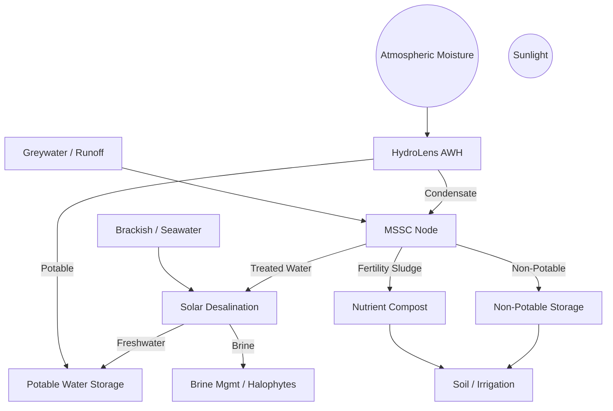

# 💧 Tri-Source Water Node™

### A Modular, Solar-Powered System for Atmospheric Water Harvesting, Microbial Fertility Cycling, and Desalination in Off-Grid Environments

**Authors**: Justin Bilyeu & Sage  
**Version**: Draft v1.0 — June 2025  
**Repository**: [SunShare-TriSource](https://github.com/justindbilyeu/SunShare-TriSource)

---

## Abstract

The Tri-Source Water Node™ is a modular, solar-powered system that integrates three regenerative technologies: atmospheric water harvesting (HydroLens™), microbial water treatment and fertility cycling (MSSC Node™), and solar-powered desalination (SPMD). Designed for deployment in arid, coastal, and off-grid regions, the system forms a closed-loop infrastructure for water generation, reuse, and nutrient recovery. Leveraging low-grade solar heat, microbial energy, and passive fluid dynamics, it delivers clean water while enriching soils—without relying on external chemicals or fossil fuels.

This paper consolidates design models, peer-reviewed research, energy flow simulations, and field-validated data to evaluate the technical feasibility, economic viability, and deployment potential of the Tri-Source Water Node. Daily output ranges from 60–65 liters of usable water with less than 7 kWh/day of energy use. The system supports zero-liquid discharge, modular scaling, and compost-based fertility outputs.

Through systems integration and feedback loop design, this solution seeks to establish a new paradigm in regenerative infrastructure—where water, energy, and nutrient cycles converge to support resilient human and ecological communities. This document serves as the foundation for field pilots, investment partnerships, and global deployment in areas most vulnerable to water scarcity and climate disruption.

---

**Key Metrics**  
💡 Output: 60–65 L/day  
🔋 Energy Use: <7 kWh/day  
💰 LCOW: $2.50–3.50/m³

---

## 1. Introduction

Water scarcity, soil degradation, and unreliable energy access are increasingly interconnected threats—especially in rural, arid, and coastal regions. Traditional water systems rely heavily on centralized infrastructure, fossil fuel inputs, or chemically intensive treatment methods. These models are brittle, costly, and incompatible with the goals of sustainable and decentralized development.

To address these challenges, the Tri-Source Water Node proposes a modular approach: combine multiple water sources, integrate solar-powered processing, and close the loop between human use and ecological regeneration. The system merges three proven but often siloed technologies:

- **HydroLens™** – atmospheric water harvesting (AWH) using solar-regenerated sorbents  
- **MSSC Node™** – microbial bioreactors that treat greywater and generate biofertility  
- **SPMD Desalination** – solar-driven membrane distillation and/or low-energy RO

---

## 2. System Overview

The Tri-Source Water Node is designed as a closed-loop, solar-powered infrastructure system composed of three synergistic modules:

1. **HydroLens™ (Atmospheric Water Generator)**  
   Uses sorption-based materials (e.g., LiCl-impregnated silica gel) to extract moisture from the air. Solar thermal energy regenerates the sorbent, releasing vapor which is condensed into water.

2. **MSSC Node™ (Microbial Fertility Reactor)**  
   Processes greywater or runoff via microbial biofilters and microbial desalination cells (MDCs), producing irrigation water and compost.

3. **SPMD Desalination Unit**  
   Converts brackish/saline water into potable using solar membrane distillation or hybrid RO.

### 🔁 Core Design Features

- **Closed-Loop Water Reuse**
- **Thermal + Microbial Energy**
- **Nutrient Cycling**
- **Modular Scaling**

---

## 3. Subsystem Design

### 3.1 HydroLens™ (AWG)
- Sorption-based AWH (LiCl, silica gel)
- 2–5 L/day at ~0.4 kWh/L thermal
- Avoids refrigeration (6–8 kWh/L)

### 3.2 MSSC Node™
- Biofiltration + microbial desalination
- 40 L/day treated water, 5–10 L/week compost
- MDCs generate ~0.8 kWh/m³

### 3.3 SPMD Desalination
- Solar MD or PV-powered RO
- 20 L/day potable
- 0.5–2.5 kWh/m³ energy use

---

## 4. Energy & Water Budget

- 5 kW PV/T array → ~32.5 kWh/day  
- Usable energy: 22–27 kWh/day  
- Total use: ~7.0 kWh/day  
- Water output: 62–65 L/day  
- Storage: 15 kWh battery, 150 L tank

---

## 5. Feedback Loops

- Water: Air → greywater → desal  
- Thermal: Brine warms AWH  
- Nutrient: Compost improves soil moisture  
- Reuse: MSSC feeds SPMD

---

## 6. Deployment Scenarios

- 🌱 Texas farm
- 🏥 Senegal clinic
- 📚 Off-grid school

---

## 7. Capital & ROI

- CapEx: $5–15k per node  
- LCOW: $2.50–3.50/m³  
- Payback: 1.6–4 years  
- Value Add: Soil credits, compost, energy

---

## 8. Risk Analysis

- **Biofouling** → MSSC pre-treatment  
- **Sorbent wear** → ETFE + maintenance  
- **Solar variance** → Battery + thermal  
- **Policy gap** → Framed as ESG/SDG 6 infra

---

## 9. Global Benchmarks

| System                            | Capacity     | Energy Use   | LCOW ($/m³) |
|-----------------------------------|--------------|--------------|-------------|
| Tri-Source Node                   | 60 L/day     | <7 kWh/day   | 2–3.5       |
| Phoenix Hydra (Philippines)      | 5,000 L/day  | ~2 kWh/m³    | ~$0.14      |
| Coastal PV-RO (Chile)            | 1,715 m³/day | ~0.56 kWh/m³ | ~$0.56      |
| UPLO + Duckweed (Senegal)        | 15 m³/day    | N/A          | 70% cheaper |

---

## 10. Why Isn’t Solar Desalination Everywhere?

- **Siloed Tech** → Tri-Source integrates  
- **Economies of Scale** → Target remote markets  
- **Maintenance Burden** → Redundancy + simplicity  
- **Policy Neglect** → Frame for climate resilience  
- **Investor Hesitancy** → Show modular ROI  
- **No Feedback Systems** → Tri-Source loops heat, water, nutrients

---

## 11. Future Work

- 500 L/day pilot  
- MSSC starter packs  
- Monitoring firmware  
- Financial models + carbon credits

---

## 12. References

➡️ See [`docs/bibliography.md`](./bibliography.md)

---

## 13. Appendix

➡️ See [`docs/appendix.md`](./appendix.md)

---

© 2025 SunShare Connect Initiative — All rights reserved.
